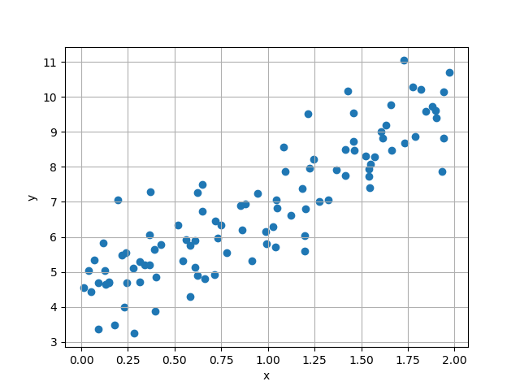
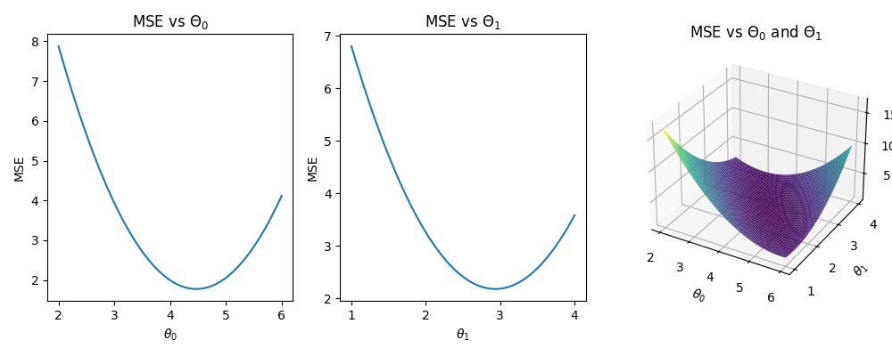
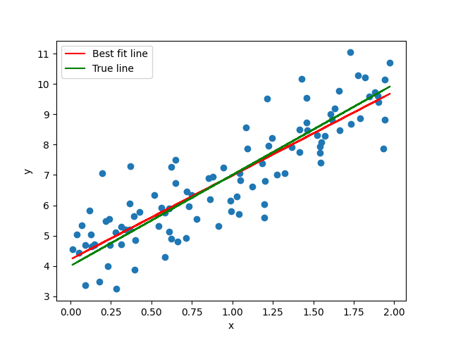
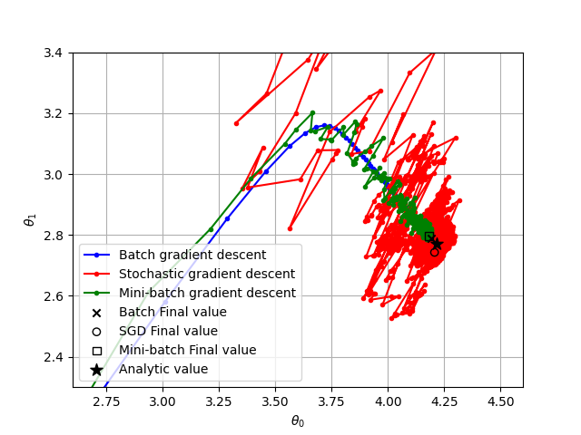
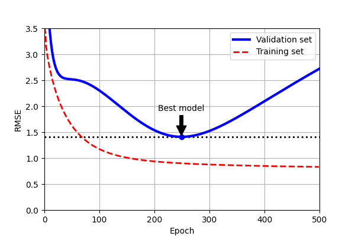
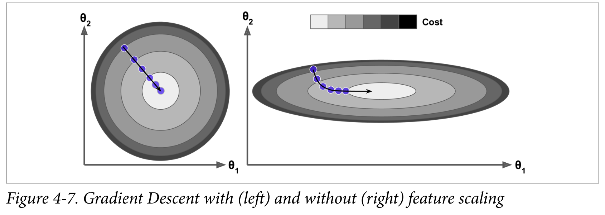

<!-- 
_class: invert lead
_paginate: skip
 -->

# Training Models with Regression and Gradient Descent

COMP 4630 | Winter 2025
Charlotte Curtis

---

## Overview
* Linear Regression and the Normal Equation
* Gradient Descent and its various flavours
* References and suggested reading:
    - [Scikit-learn book](https://librarysearch.mtroyal.ca/discovery/fulldisplay?context=L&vid=01MTROYAL_INST:02MTROYAL_INST&search_scope=MRULibrary&isFrbr=true&tab=MRULibraryResources&docid=alma9923265933604656):
        - Chapter 4: Training Models
    - [Deep Learning Book](https://www.deeplearningbook.org/)
        - Section 5.1.4: Linear Regression

---

## Linear Regression

Unlike most models, linear regression has a **closed-form** solution called the **Normal Equation**:

$$\mathbf{\hat{\theta}} = (\mathbf{X}^T \mathbf{X})^{-1} \mathbf{X}^T \mathbf{y}$$

where

* $\mathbf{\hat{\theta}}$ are the weights of the model minimizing the **cost function**
* $\mathbf{y}$ is the vector of target values
* $\mathbf{X}$ is the **design matrix** of feature values

> As usual, different sources use different notation, e.g. $\mathbf{w}$ or $\mathbf{\phi}$ instead of $\mathbf{\theta}$.

---

Consider the 1-d case:

$$\hat{y} = \theta_0 + \theta_1 x$$

we want the values of $\theta_0$ and $\theta_1$ that minimize the **Mean Square Error** between the actual and predicted $y$ values:

$$\begin{aligned}
MSE &= \frac{1}{m} \sum_{i=1}^m (\hat{y} - y_i)^2\\
MSE &= \frac{1}{m} \sum_{i=1}^m (\theta_0 + \theta_1 x_i - y_i)^2
\end{aligned}$$

<!-- y = mx + b -->

---

## Solving for $\theta_0$ and $\theta_1$

---

## Solving for $\theta_0$ and $\theta_1$

After some algebraic gymnastics, we get:

$$\begin{aligned}
\theta_1 &= \frac{\mu_y \sum_{m}x_i - \sum_m x_i y_i}{\mu_x\sum_m x_i - \sum_m x_i^2}\\
\theta_0 &= \mu_y - \theta_1 \mu_x
\end{aligned}$$

where $\mu_x$ and $\mu_y$ are the means of the $x$ and $y$ values, respectively.

---

## Expanding to matrix form
Instead of the scalar $x$ or even vector $\mathbf{x}$, we can use a **design matrix** $\mathbf{X}$ to represent the feature values:

$$\mathbf{X} = \begin{bmatrix} x_{11} & x_{12} & \cdots & x_{1n} \\ x_{21} & x_{22} & \cdots & x_{2n} \\ \vdots & \vdots & \ddots & \vdots \\ x_{m1} & x_{m2} & \cdots & x_{mn} \end{bmatrix}$$

where each row is an instance (sample) and each column is a feature.

> It is common for the first column to be all ones, representing the bias term

<!-- What is the meaning of yhat being a vector? -->

---

## Back to the linear regression problem...
* We can rewrite the estimate in matrix notation:
    $$\hat{\mathbf{y}} = \mathbf{X} \mathbf{\theta}$$

* The MSE can be written as:

    $$MSE = \frac{1}{m}\sum_{i=1}^m (\hat{y}_i - y_i)^2 = \frac{1}{m} (\mathbf{X} \mathbf{\theta} - \mathbf{y})^T (\mathbf{X} \mathbf{\theta} - \mathbf{y})$$

    where we've used the trick of substituting $\mathbf{a}^T \mathbf{a} = \sum_i a_i^2$

* :abacus: Find the gradient of the MSE w.r.t $\mathbf{\theta}$, set it to zero, and solve for $\mathbf{\theta}$

---

## Properties of matrices and their transpose

The following properties are useful for solving linear algebra problems:

- $\mathbf{(AB)}^T = \mathbf{B}^T \mathbf{A}^T$

- $\mathbf{(A + B)}^T = \mathbf{A}^T + \mathbf{B}^T$

- $\mathbf{(A^{-1})}^T = (\mathbf{A}^T)^{-1}$

- $\mathbf{(A^T)}^T = \mathbf{A}$

Additionally, any matrix or vector multiplied by $\mathbf{I}$ is unchanged.

---

## The Normal Equation

We made it! The **Normal Equation** is again:

$$\mathbf{\hat{\theta}} = (\mathbf{X}^T \mathbf{X})^{-1} \mathbf{X}^T \mathbf{y}$$

* No optimization is required to find the optimal $\mathbf{\theta}$
* Limitations:
    - $\mathbf{X}^T \mathbf{X}$ must be invertible and small enough to fit in memory
    - The computational complexity is (at least) $O(n^3)$
* Even in linear regression problems, it is common to use **gradient descent** instead due to these limitations

---

## Gradient Descent
The goal of gradient descent is still to minimize the cost function, but it follows an iterative process:
1) Start with a random $\mathbf{\theta}$
2) Calculate the gradient $\nabla_{\mathbf{\theta}}$ for the current $\mathbf{\theta}$
3) Update $\mathbf{\theta}$ as $\mathbf{\theta} = \mathbf{\theta} - \eta \nabla_{\mathbf{\theta}}$
4) Repeat 2-3 until some stopping criterion is met

    where $\eta$ is the **learning rate**, or the size of step to take in the direction opposite the gradient.

<!-- Draw a gradient on the board and illustrate steps -->

---

## Stochastic Gradient Descent
* Standard or **batch** gradient descent uses the entire training set to calculate the gradient for each instance at every step
* **Stochastic Gradient Descent** uses a single random instance at each step:
    1) Start with a random $\mathbf{\theta}$
    2) Pick a random instance $\mathbf{x}_i$ (row in the design matrix)
    3) Calculate the gradient $\nabla_{\mathbf{\theta}}$ for the current $\mathbf{\theta}$ and $\mathbf{x}_i$
    4) Update $\mathbf{\theta}$ as $\mathbf{\theta} = \mathbf{\theta} - \eta \nabla_{\mathbf{\theta}}$
    5) Repeat 2-4 until some stopping criterion is met

---

## Mini-batch Gradient Descent

* **Mini-batch** gradient descent uses a random *subset* of the training set
* Less chaotic than stochastic, but faster than batch
* Most common type of gradient descent used in practice

---

## Gradient Descent Hyperparameters
* The **learning rate** $\eta$ - size of step taken
* No rule that it needs to be constant! A simple **learning schedule** is to decrease $\eta$ over time, e.g.:
    $$\eta = \frac{t_0}{t + t_1}$$
    where $t$ is the current iteration and $t_0$ and $t_1$ are hyper-parameters
* For mini-batch, the **batch size** is another hyper-parameter
* The number of **epochs**, or times to process the entire training set

---

## Stopping Criteria

* The simplest stopping criterion is to set a maximum number of epochs
* **Early stopping** is another option:
    - Evaluate on a validation set at regular intervals
    - Stop when the validation error starts to increase
* The comparison between training and validation performance can also help prevent **overfitting**

---

## Loss functions
* The **loss function** is the function being minimized by gradient descent
* MSE is **convex** and guaranteed to have a single global minimum, but many other loss functions have multiple local minima
* The relative scale of the features can affect the convergence:

    

<footer>Figure from Scikit-Learn book</footer>

---

## Higher-order Polynomials
* Higher order polynomials can be solved with the Normal Equation as well:
  $$y = \theta_0 + \theta_1 x + \theta_2 x^2 + \cdots + \theta_n x^n$$
* Just include the higher order terms in $\mathbf{X}$
* This is still a linear regression problem because the coefficients are linear!
* Risk of **overfitting** the data
* Easy way to regularize: drop one or more of the higher order terms

---

## Regularization
* If the model fits the training data *too* well, but doesn't generalize to new data, it is **overfitting**
* **Regularization** imposes additional constraints on the weights
* Example: **Ridge Regression** adds a term to the loss function:
    $$J(\mathbf{\theta}) = MSE(\mathbf{\theta}) + \alpha \frac{1}{2} \sum_{i=1}^n \theta_i^2$$
    where $\alpha$ is the **regularization parameter**
* The regularization term is only added during training, not evaluation

> Note: the term **cost** function is often used instead of **loss** function

---

## Logistic regression and beyond
Logistic regression is a binary classifier that uses the **logistic function** (aka **sigmoid function**) to map the output to a range of 0 to 1:

$$\sigma(t) = \frac{1}{1 + e^{-t}}$$

resulting in the loss function (trust me on this one):

$$J(\mathbf{\theta}) = -\frac{1}{m} \sum_{i=1}^m \left[ y_i \log(\hat{p}_i) + (1 - y_i) \log(1 - \hat{p}_i) \right]$$

where $\hat{p}_i = \sigma(\mathbf{\theta}^T \mathbf{x}_i)$ is the probability that instance $i$ is positive.

---

The gradient of the loss function for logistic regression is:

$$\nabla_{\mathbf{\theta}} J(\mathbf{\theta}) = \frac{1}{m} \sum_{i=1}^m \left( \sigma(\mathbf{\theta}^T \mathbf{x}_i) - y_i \right) \mathbf{x}_i$$

* There is no (known) analytical solution this time, but we can still use gradient descent!
* In this case it's still convex, so we don't have to worry about local minima
* In general, for a loss function to work with gradient descent, it must be:
    - **Continuous** and
    - **Differentiable**
    - ... at the locations where you evaluate it

---

<!-- _class: lead invert -->

# Next up: Backpropagation! 